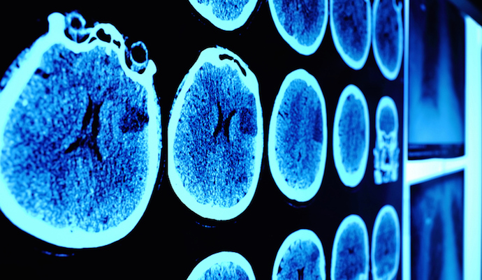

# Brain Tumor Detector

This repository contains the development of a deep learning brain tumor detecting model based on a dataset with 44 classes of brain tumors. The primary goal is help or offer a confirmation service for small medical facilities or mobile medical facilities which have no capacity to have proper equipment to help interpret imaging results.

## Dependencies
1. OS
2. Time
3. Shutil
4. Pathlib
5. Itertools
6. OpenCV
7. Tensorflow
8. Numpy
9. Pandas
10. Seaborn
11. Matplotlib
12. Sklearn
13. Keras

## About the data
The dataset contains 44 different classes of brain cancer tumors with 251 images per class. The tumor classes are further divided into T1 and T2. The classes range from normal T1 and normal T2 to  tuberculoma T1, T1C+, T2.

## Data Split
A data generator was used to convert images into tensors.
A data splitting function was used to split the data into train and test. Train dataset was 80% of the data provided.
Further splitting was done and to get a validation dataset from the train dataset. The validation dataset containec 50% of the test dataset.
Train data  = 40%
validation data = 40%
Test data = 20%

## Neural Network Architecture
Base model - EfficientnetB3
Batch Normalization to normalize pixel values to speedup computation.
Dense layer with kernel_regularizer, activity_regualrizer, bias_regularizer, activation ser at 0.016, 0.006, 0.006, relu respectively.
Dropout Layer with with rate at 0.45 and seed at 123
Dense output layer with a relu activation

## Why this architecture
Transfer learning using EfficientnetB3 as the base model to capture low level image details like edges.
The rest of the layers are used to obtain high level details like shapes that are specific to tumors. 
Considering my computational limitations, this combinations helps save alot of time
||Validation Set| Test Set|
|:---|:---|---|
|Accuracy| 94.99%| 95.98%|